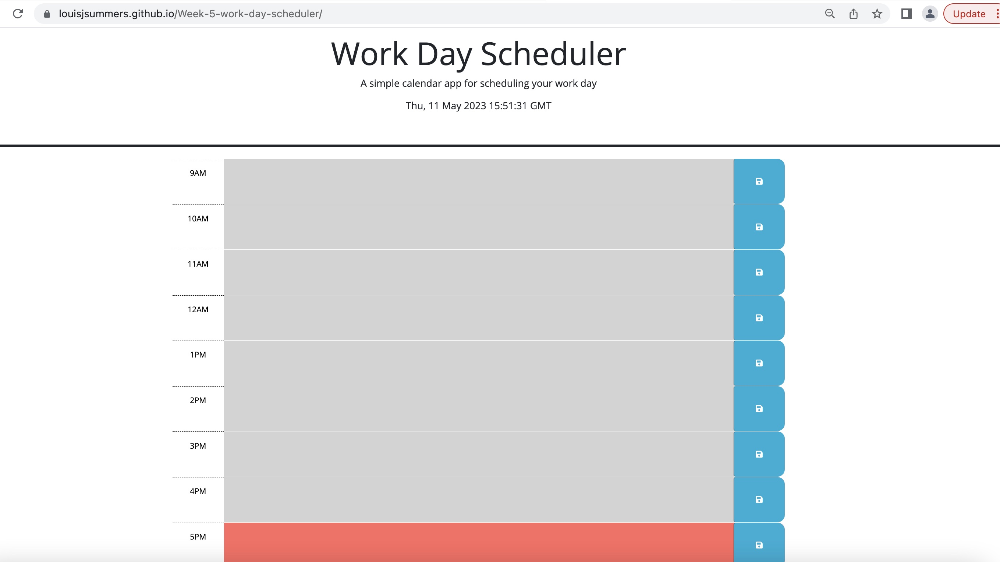

# Week-5-work-day-scheduler

## User Story

AS AN employee with a busy schedule
I WANT to add important events to a daily planner
SO THAT I can manage my time effectively

## Challenges to complete

GIVEN I am using a daily planner to create a schedule

- WHEN I open the planner THEN the current day is displayed at the top of the calendar

- WHEN I scroll down THEN I am presented with time blocks for standard business hours

- WHEN I view the time blocks for that day THEN each time block is color-coded to indicate whether it is in the past, present, or future

- WHEN I click into a time block THEN I can enter an event

- WHEN I click the save button for that time block THEN the text for that event is saved in local storage

- WHEN I refresh the page THEN the saved events persist

### Solutions

- When the user opens the planner page then the current date is displayed

- All the time blocks for the standard business hours of the day are displayed

- Then when viewed, the time blocks are also colour coded correctly depending on wether the moment is past present or future.

- The user can select the time block boxes to enter the data that they want to plan their day

- The save button is not storing to local storage. I havnt managed to complete this part

## Webpage screenshot

## LINKS

https://louisjsummers.github.io/Week-5-work-day-scheduler/

https://github.com/LouisJsummers/Week-5-work-day-scheduler
